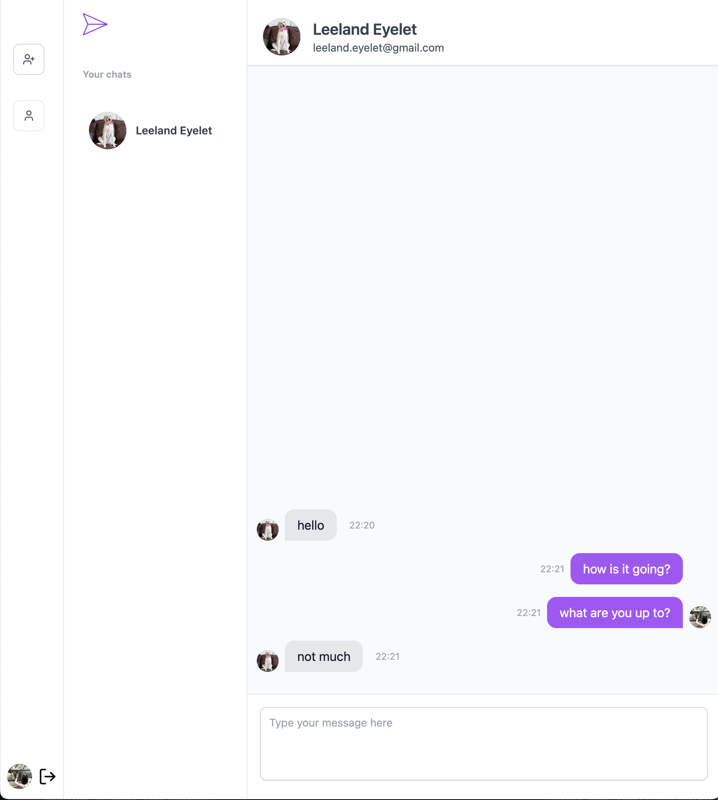
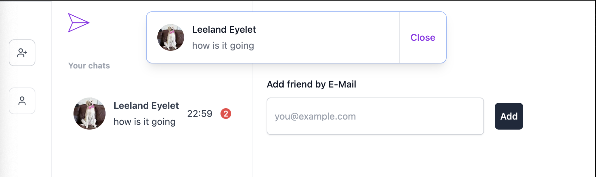
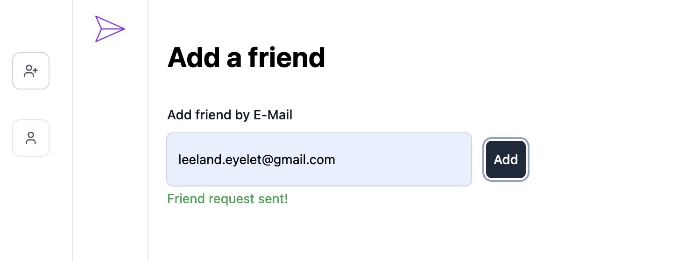

# CHAT APP

Realtime chat application, built with NextJS, TypeScript, and TailwindCSS.

## Getting Started

**Step 1:** Review the .env-sample file to ensure you have the necessary credentials to run the app.

**Step 2:** Install the required dependencies:

```bash
npm i
```

**Step 3**: Start the development server:
```bash
npm run dev
```

Visit http://localhost:3000/login (or the port you are using) to access the authentication page. Log in using Google to start using the app.


## Features

- Real-time chat functionality
- Instant toast notifications and badges
- Add friends
- View, accept, or decline friend requests

## Tech Stack

- NextJS
- TypeScript
- TailwindCSS
- Redis
- Pusher
- Socket.io

## Interface

- [Screenrecording demo here](./public/chat-app-video.mp4)




